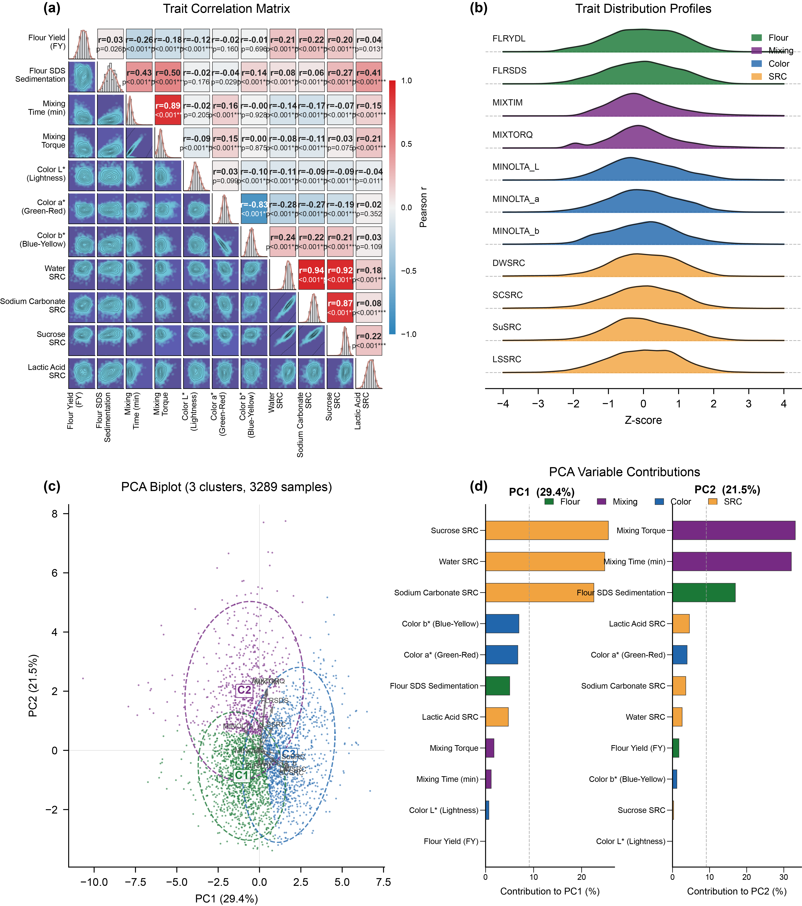
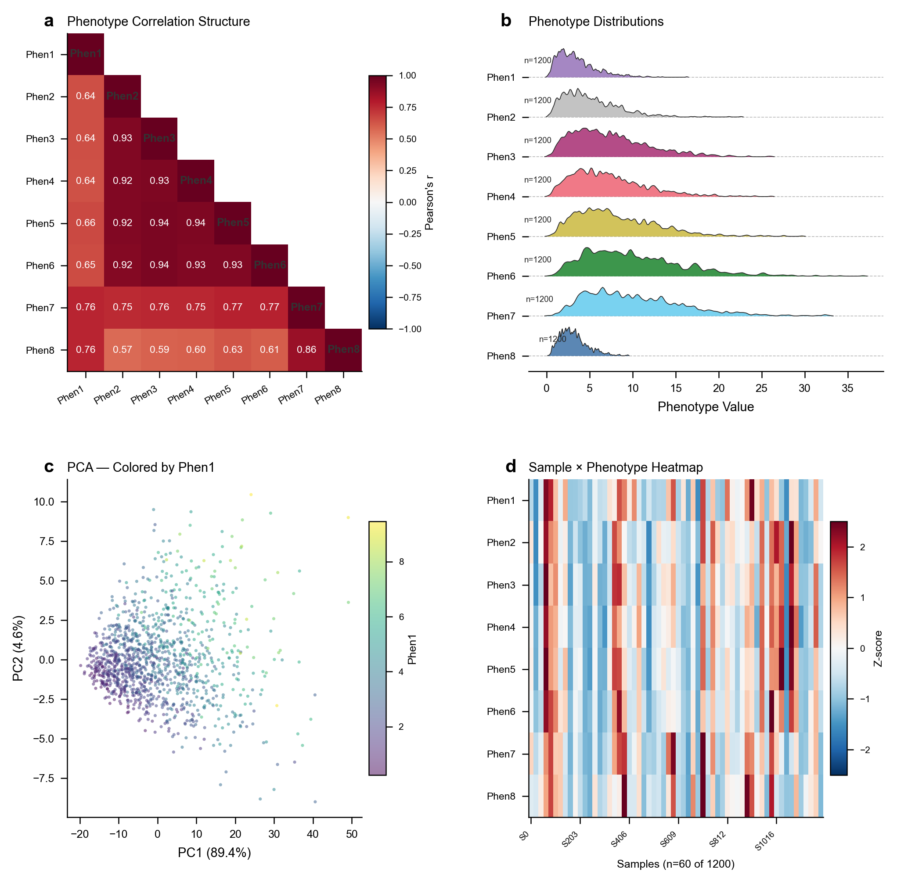
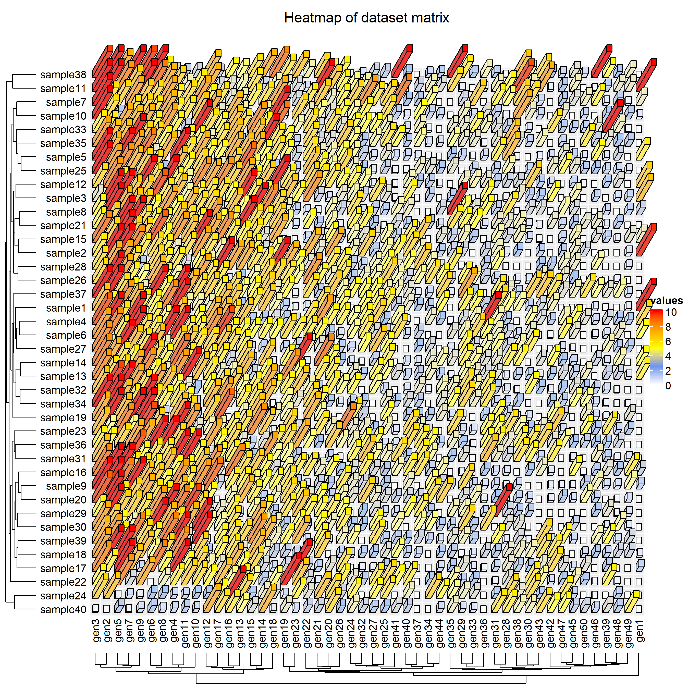
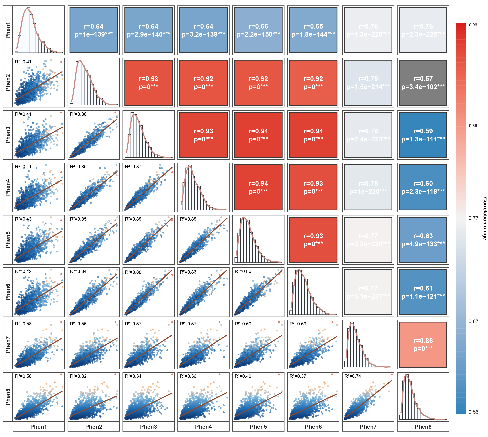
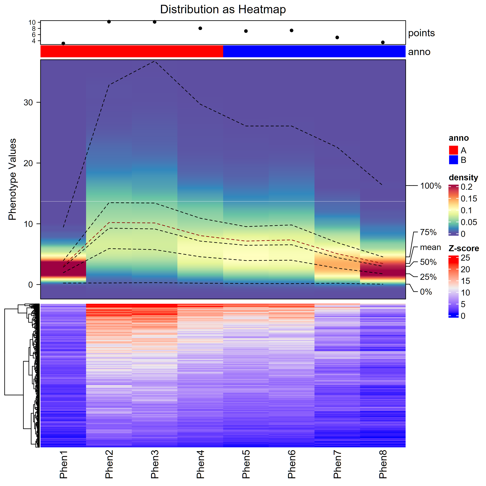
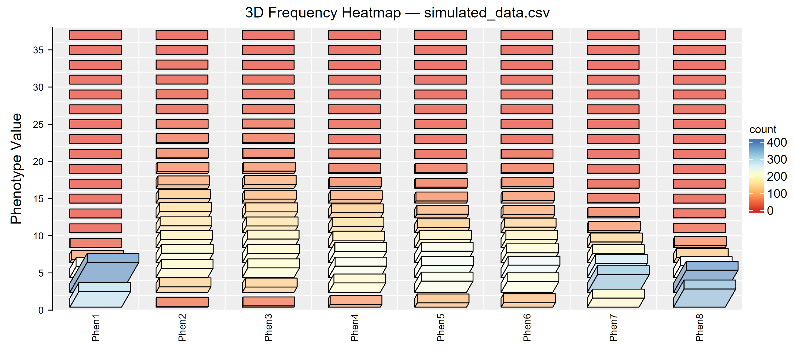
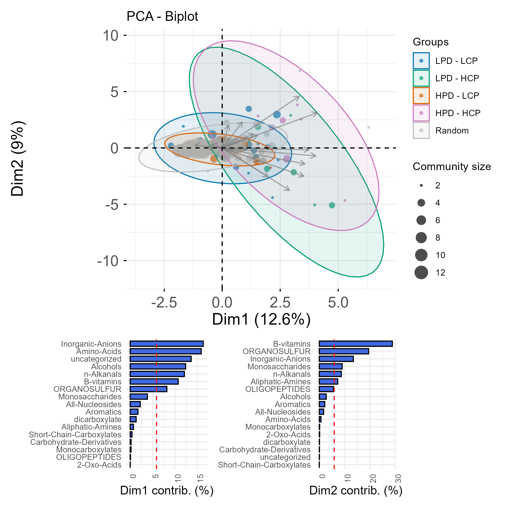
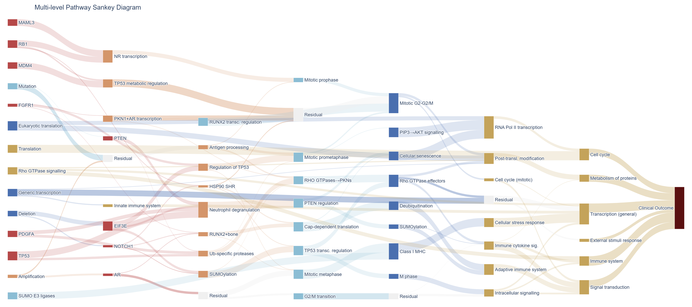

<div align="center">
  <h1>Publication Figure Design</h1>
  <p><strong>A submission-grade scientific figure generation skill — automates the full pipeline from data interpretation to journal-formatted output.</strong></p>
  <p>
    Question-driven · reference-first orchestrator · 29 figure types · evidence-based QA · Vector PDF delivery · Statistics report
  </p>
  <p>
    <a href="LICENSE"></a>
    <a href="#installation"></a>
    <a href="#figure-type-gallery"></a>
    <a href="#quality-assessment"></a>
    <a href="README.md"></a>
  </p>
  <p>
    <a href="#about">About</a>
    · <a href="#installation">Installation</a>
    · <a href="#figure-type-gallery">Figure Types</a>
    · <a href="#workflow">Workflow</a>
    · <a href="#directory-layout">Structure</a>
    · <a href="#quality-assessment">QA</a>
    · <a href="#contributing">Contributing</a>
    · <a href="README.md">中文</a>
  </p>
</div>

---

**Publication Figure Design** takes "question-driven, reference-first, not template-driven" as its core principle. Every figure runs through the persisted state machine `Route → Intake → Reference Retrieval → Reference Inspection → Design Spec → Binding → Render → Compare → Critique → Repair → QA → Export`, delivering submission-ready vector PDF masters + 300dpi PNG previews + statistical reports. For updates, follow our WeChat official account: **科研绘图酱**.

### Current runtime entrypoints

```text
pfd run <task-spec.json>
pfd reference ingest <image> <figure-type>
pfd reference analyze <reference-id>
pfd reference review <reference-id> <review.json>
pfd index build
pfd eval quick|full|visual|release  # release is identical to CI
```

## Scientific Figure Design Compiler

The production chain keeps the existing 12-stage state machine and compiles reference
evidence into auditable contracts:

`ScientificContract → ReferenceDNA → StyleCapsule + JournalProfile → DesignPacket → DesignPatch → RenderTrace → L0/L1/L2/L3 QA`

Raster, SVG, PDF, and plotting-code inputs use separate analyzers. Raster evidence records
font class and relative hierarchy rather than guessing an exact font. Retrieval is a transparent
metadata + semantic + structure + StyleDNA hybrid index with deterministic NumPy search at the
current corpus size; optional SigLIP2/DINO adapters remain outside core dependencies.

Concrete references are opened and measured before implementation material is selected; structure, style, component, and annotation references are retrieved independently, and the final raster/vector is compared back to the reference.

---

## Preview

<p align="center">
  
</p>

<details>
<summary>Click to expand more examples</summary>
<p align="center">
  
</p>
</details>

---

## About

Publication Figure Design is a skill package for AI coding assistants (Claude Code, Codex, and others). It encodes the figure preparation conventions of Nature, Cell, and Science family journals — Arial/Helvetica typography, 89 mm / 183 mm column widths, PDF vector export, and 300 dpi raster previews — along with the visual parameters of 29 common figure types into `SKILL.md` and its routed reference/runtime bundle. When a user provides data and a scientific question, the skill runs the persisted Route → Intake → Reference Retrieval → Reference Inspection → Design Spec → Binding → Render → Compare → Critique → Repair → QA → Export lifecycle, with machine-readable artifacts and gates at every transition.

The skill does not replace the plotting capabilities of Python or R. It provides a set of structured constraints and priors so that LLM-generated plotting code adheres to CNS journal visual standards, reducing the manual effort of adjusting typography, color schemes, and export parameters. For multi-panel compositions, the skill supports mixed Python and R orchestration: R panels are rendered to bitmaps via the Cairo graphics device, and the Python `compose.py` layout engine tiles them at exact physical dimensions.

### Design Principles

| Principle | Description |
|-----------|-------------|
| **One figure, one message** | A reviewer should grasp the core conclusion in 3 seconds; remove gridlines, borders, and redundant legends |
| **Restrained color > abundant color** | 2–4 semantic main colors + 1 accent; never use matplotlib/ggplot defaults |
| **Design for print** | Journal column widths are fixed (single 89 mm / double 183 mm); set dimensions at creation, never scale down |
| **Vector first** | Lines, scatter, bars → PDF/SVG; only true raster content (heatmap blocks, micrographs) uses ≥300 dpi TIFF/PNG |

---

## Core Capabilities

| Capability | Description |
|------------|-------------|
| **Archetype Classification** | Four paradigms: `quantitative_grid`, `schematic-led`, `image plate + quant`, `asymmetric_mixed` — automatically drive layout and hero-panel strategy |
| **29 Figure Types** | Heatmap / Volcano / Bar / Scatter / Box / PCA / RDA / Radar / Sankey / AUROC / Ridge / Violin / Marginal Density / KDE / Mantel Correlation / UpSet / Forest / Confusion Matrix / Manifold / Stacked Bar Scatter / Paired Box / Marker Gene Dot Plot / Trend Line / 3D Heatmap / Frequency Heatmap / Density Heatmap / Correlation Matrix / Grouped Correlation Matrix / Grouped Violin — each with production scripts (`.py` + `.R`) and preview PNG |
| **Reference-first compilation** | Retrieve structure/style/palette/component roles from `assets/visual-references/`, compile Reference DNA into a DesignPacket, and reuse production assets only through the explicit asset-adaptation route |
| **Cross-Type Parameter Inheritance** | When no production script exists, borrow Class A (hard params: colors/alpha/linewidth), Class B (scaling params: font sizes/dimensions), and Class C (logic params: legend on/off, grid on/off) from the nearest figure type |
| **Multi-Language Composition** | R panels run natively → output spec-correct PNGs; Python composition engine tiles them by exact physical dimensions |
| **Auto Hero-Panel Detection** | The panel carrying the core conclusion automatically gets larger visual weight; supporting panels are arranged as subordinates |
| **Layered QA** | L0 Hard Technical → L1 Scientific → L2 Structural Visual → L3 Perceptual/Aesthetic; each layer is persisted and any hard-gate failure blocks a production-ready export |
| **Data Validation Gate** | Pre-render per-panel checks — volcano needs ≥10 significant DE genes, AUROC curve separation ≥0.15, heatmap must have cross-row variance — refuse rendering if checks fail |
| **Statistics & Reproducibility Report** | Mandatory per-figure: n definition, center statistic (mean/median), spread metric (SD/SEM/95% CI), test name, multiple-comparison correction, source-data traceability |
| **Journal Color System** | Nature cool-blue, Cell warm, Science conservative grey; colorblind-friendly; avoids red-green-only differentiation |
| **Reviewer Simulation Mode** | Inspect output through five lenses — scientific clarity, visual hierarchy, color accessibility, typography legibility, overall polish — with must-fix vs. suggestion grading |

---

## Figure Type Gallery

> The example figures shown are generated from the project's private data assets and serve as style references only. When users request the same figure type, scripts preserve the established visual language (color scheme, font specification, layout logic, graphical hierarchy) while adapting to the user's actual data. Private assets are continuously updated. Follow WeChat official account: 科研绘图酱

| Figure Type | Preview | Key Features | Typical Use Cases |
|------------|---------|-------------|-------------------|
| 3D Heatmap |  | 3D columns encode matrix values with height + color dual encoding | Multi-factor interaction effects, genotype × environment matrix, 3D intensity distribution |
| AUROC Curve |  | TPR–FPR curve with diagonal reference line and AUC annotation | Classifier evaluation, multi-model ROC comparison, threshold sensitivity analysis |
| Bar Chart |  | Single-variable bar height encoding with error bars | Between-group mean comparison, single-metric ranking, count statistics |
| Correlation Density |  | Scatter with 2-D kernel density contours overlaid | Two-variable relationship strength, density cluster identification, outlier detection |
| Correlation Matrix |  | Square grid with color + value dual encoding of pairwise correlations | Multi-variable correlation overview, collinearity check before feature selection |
| Density Heatmap |  | Continuous 2-D kernel density as color gradient across the full grid | Large-sample point cloud density visualization, replaces overplotted scatter |
| Frequency 3D Heatmap |  | 3-D columns showing binned frequencies across two categorical dimensions | Allele frequency distribution, two-factor count cross-display |
| Grouped Correlation Matrix |  | Multiple correlation matrices split by group, displayed side by side | Comparing correlation structure across treatments/environments |
| Grouped Bar Chart |  | Multiple sub-group bars juxtaposed within each category | Multi-treatment × multi-metric comparison, replicate group differences |
| Mantel Correlation |  | Correlation heatmap with connection curves annotated with Mantel r and significance | Environmental factor vs. community/genotype matrix association, distance matrix correlation |
| PCA Biplot |  | Samples projected onto PC plane with confidence ellipses | Population structure analysis, sample clustering trends, dimensionality reduction |
| Radar Chart |  | Multi-axis radial arrangement with closed polygon for composite performance | Multi-metric variety/model evaluation, trait profile comparison |
| Ridge Plot |  | Multiple density curves stacked vertically with vertical offset | Multi-group/time-series distribution comparison, trait distribution trends |
| Sankey Diagram |  | Flow width encoding between nodes across multiple stages | Pathway/process flow visualization, categorical flow attribution |
| Stacked Bar Scatter |  | Stacked bars carrying composition ratios with overlaid scatter for individual values | Composition display while preserving raw sample points |
| Trend Line |  | Line plot along continuous variable (time/environmental gradient) with confidence band | Trait variation along environmental gradients, time-series trends |
| Violin Plot |  | Mirrored density outline showing distribution shape | Between-group distribution shape and dispersion comparison, non-normal data display |

---

## Single-image reference intake

Give an agent the image and say that it should be saved to the reference library. The skill opens the actual pixels, classifies the dominant figure family and visual grammar, records tags and provenance, asks the agent to add a synthetic-data visual-grammar reconstruction with a `reconstruction.png` preview, builds an equal-size source/reconstruction comparison with explicit deviations, copies the image with sidecar metadata, rebuilds the index, and returns the reference ID. Original source data or paper code are not required; without reproduction code or a fidelity review the record remains `pending` and cannot enter the reviewed recommendation pool. Intake defaults to `private_reference`; public redistribution requires explicit licensing. See **Single-image reference intake** in `SKILL.md` and [visual-reference-library.md](references/visual-reference-library.md).

## Workflow

```text
┌─────────────────────────────────────────────────────────────┐
│  User Intent Parsing                                         │
└─────────────────────────────────────────────────────────────┘
  Route → Intake → Reference Retrieval → Reference Inspection
      → Design Spec → Binding → Render → Compare → Critique
      → Repair → QA → Export

Reference DNA → StyleCapsule + JournalProfile → DesignPacket
      → CandidateSet → DesignPatch → RenderTrace → layered QA
```

**Core principle**: The scientific contract precedes visual references. References supply measurable visual grammar only; every candidate consumes the same `TypographySpec`, `PaletteSpec`, `LayoutSpec`, and `ComponentSpec` before structured critique/repair and layered QA.

---

## Installation

`publication-figure-design` uses `SKILL.md` as a thin entry point and `src/publication_figure_design/` as the current runtime. A complete installation must preserve `references/`, `scripts/`, `assets/`, `profiles/`, `indexes/`, `schemas/`, and `install/`; maintenance scripts are thin CLI wrappers around the orchestrator.

All repository Python commands use the local `piepaper` interpreter:

```powershell
& "D:\Anaconda\envs\piepaper\python.exe" <script-or-module>
```
See `references/runtime-environment.md`; never silently fall back to Conda `base` or system Python.

From the repository root, install the current runtime into that same environment so
the `pfd` CLI is available:

```powershell
& "D:\Anaconda\envs\piepaper\python.exe" -m pip install -e .
```

### Reference-analysis dependencies

The core plotting runtime is listed in `requirements.txt`. For reference intake
and rendered comparison, install the small optional profile as well:

```bash
& "D:\Anaconda\envs\piepaper\python.exe" -m pip install -r requirements.txt
& "D:\Anaconda\envs\piepaper\python.exe" -m pip install -r requirements-reference.txt
```

The optional profile provides SSIM (`scikit-image`) and palette extraction
(`extcolors`, `colorthief`). ChartMimic is indexed as a compact catalog under
`assets/reference-benchmarks/chartmimic/`; its external checkout is not copied
into the Skill.

### Claude Code

If Claude Code is not yet installed:

```bash
npm install -g @anthropic-ai/claude-code
claude
```

Clone the repository to a stable path and install the skill:

```bash
mkdir -p ~/ai-skills
cd ~/ai-skills
git clone https://github.com/future3317/publication-figure-design.git publication-figure-design
cp -r publication-figure-design ~/.claude/skills/
```

After installation, describe your task naturally in a Claude Code session — the skill triggers automatically:

```text
Please use publication-figure-design to analyze the multip-traits.csv data in the project files and perform a visualization analysis.
```

```text
Use publication-figure-design to plot the data.csv data as a Nature-style differential expression volcano plot.
```

To update:

```bash
cd ~/ai-skills/publication-figure-design
git pull
cp -r . ~/.claude/skills/publication-figure-design/
```

### Codex

Codex loads skills through `install/codex/` which provides `manifest.yaml` + `instructions.md`. Copy the required directories to `~/.codex/skills/publication-figure-design/`:

```bash
git clone https://github.com/future3317/publication-figure-design.git publication-figure-design
cd publication-figure-design
mkdir -p ~/.codex/skills/publication-figure-design
cp -r SKILL.md references/ scripts/ assets/ install/codex/* ~/.codex/skills/publication-figure-design/
```

After installation, describe your task naturally in a Codex session — the skill activates automatically based on trigger rules in `manifest.yaml`.

You can also ask Codex to install for you:

```text
Install the Codex skill from https://github.com/future3317/publication-figure-design.git.
Clone it into a directory named publication-figure-design, then copy SKILL.md, references/, scripts/, assets/, and install/codex/ to ~/.codex/skills/publication-figure-design/.
Keep the full directory structure — do not copy only SKILL.md.
```

### Cursor

Copy the skill rules file to your project root. Cursor will automatically follow the specifications when generating code:

```bash
git clone https://github.com/future3317/publication-figure-design.git publication-figure-design
cp publication-figure-design/install/cursor/.cursorrules <your-project>/.cursorrules
```

The `.cursorrules` file includes color palettes, typography baselines, export specifications, and other core rules. To update, re-run the copy command.

### GitHub Copilot

Copy the skill instructions file to your project's `.github/` directory. Copilot loads this context when generating code:

```bash
git clone https://github.com/future3317/publication-figure-design.git publication-figure-design
mkdir -p <your-project>/.github
cp publication-figure-design/install/copilot/copilot-instructions.md <your-project>/.github/
```

If you already have `.github/copilot-instructions.md`, append this skill's content to the end of the file.

### Other Agents

For other AI coding assistants:

1. Keep a stable local clone of the repository
2. Create a lightweight subagent, slash command, or custom prompt wrapper that points to `SKILL.md`
3. Ensure `references/`, `scripts/`, `assets/` stay at the same relative path as `SKILL.md`
4. If the agent has its own format requirements, adjust the frontmatter and body structure

---

## Directory Layout

```text
	publication-figure-design/        ← Core skill package (this directory)
    ├── README.md                      ← Documentation (Chinese)
    ├── README_EN.md                   ← Documentation (English)
    ├── LICENSE                        ← Apache 2.0 License
    ├── SKILL.md                       ← Skill entry point: 8-step workflow + all rules
    ├── references/                    ← 16 shared knowledge documents
    │   ├── figure-contract.md         ← Figure contract: core conclusion + evidence chain + review risks
    │   ├── color-palettes.md          ← Color system: categorical/diverging/sequential + colorblind-friendly
    │   ├── typography.md              ← Font specification: Arial/Helvetica, ≥5pt minimum
    │   ├── journal-specs.md           ← Journal dimensions: single 89mm / double 183mm
    │   ├── export-specs.md            ← Export specification: PDF/SVG vector + 300dpi PNG
    │   ├── multipanel-layout.md       ← Multi-panel layout: anti-redundancy + hero panel + narrative order
    │   ├── directory-map.md           ← Figure-type directory mapping: keywords → asset paths
    │   ├── checklist.md               ← Complete QA checklist
    │   ├── common-pitfalls.md         ← Common pitfalls and solutions
    │   ├── revision-cases.md          ← Reviewer revision case library
    │   ├── journal-intel.md           ← Journal-specific intelligence
    │   ├── figure-deconstruction.md   ← Figure deconstruction: compositional inspiration
    │   ├── matplotlib.md              ← Python/matplotlib/seaborn guide
    │   ├── complexheatmap.md          ← R ComplexHeatmap guide
    │   ├── r-rendering.md             ← R PNG rendering specification (cairo device)
    │   └── compose.R                  ← R composition reference implementation
    ├── src/publication_figure_design/ ← current compiler core
    │   ├── contracts/                 ← ScientificContract, ReferenceDNA, DesignPacket, etc.
    │   ├── reference_intelligence/    ← source analyzers, DNA, hybrid retrieval
    │   ├── style/                     ← JournalProfile, StyleCapsule, StyleSpec compiler
    │   ├── design/                    ← candidates and deterministic DesignPatch
    │   ├── layout/                    ← mm/pt primitives and constraints
    │   ├── renderers/                 ← SVG/vector assembler
    │   └── qa/                        ← L0/L1/L2/L3 QA, RenderTrace, anti-copy
    ├── profiles/                      ← journal profiles + style capsules
    ├── evals/                         ← activation train/validation/holdout data
    ├── scripts/                       ← thin CLI wrappers, maintenance, release gate
    ├── assets/
    │   ├── figures/                   ← 29+ figure-type production scripts and previews
    │   │   ├── 3DHeatmap/             ← 3-D heatmap (R/ComplexHeatmap)
    │   │   ├── AUROC/                 ← AUROC curves
    │   │   ├── BarAblation/           ← Ablation study bars
    │   │   ├── BarCategorical/        ← Categorical bar charts
    │   │   ├── BarComparison/         ← Method comparison bars
    │   │   ├── BarComposition/        ← Composition bars
    │   │   ├── BarDistribution/       ← Distribution bars
    │   │   ├── ConfusionMatrix/       ← Confusion matrix
    │   │   ├── CorrelationMatrix/     ← Correlation matrix (ggpairs)
    │   │   ├── DensityHeatmap/        ← Density heatmap
    │   │   ├── Frequency_3DHeatmap/   ← Frequency 3-D heatmap
    │   │   ├── GroupedBarChart/       ← Grouped bar chart
    │   │   ├── GroupedCorrelationMatrix/ ← Grouped correlation matrix
    │   │   ├── GroupedViolin/         ← Grouped violin plot
    │   │   ├── KernelDensity/         ← Kernel density estimation
    │   │   ├── LineTrend/             ← Trend line plot
    │   │   ├── Manifold/              ← Manifold visualization
    │   │   ├── MantelCorrelation/     ← Mantel correlation test
    │   │   ├── MarginalDensity/       ← Marginal density plot
    │   │   ├── MarkerGeneDotPlot/     ← Marker gene dot plot
    │   │   ├── PCA/                   ← PCA principal component analysis
    │   │   ├── PairedBoxScatter/      ← Paired box-scatter plot
    │   │   ├── Radar/                 ← Radar chart
    │   │   ├── RidgePlot/             ← Ridge density plot
    │   │   ├── SankeyDiagram/         ← Sankey flow diagram
    │   │   ├── StackedBarScatter/     ← Stacked bar scatter composite
    │   │   ├── Violin/                ← Violin plot
    │   │   ├── heatmap/               ← Clustered heatmap
    │   │   ├── volcano/               ← Volcano plot
    │   │   ├── basic-plots/           ← Basic plot types
    │   │   ├── multipanel/            ← Multi-panel templates
    │   │   └── other/                 ← Long-tail figure types
    │   └── figure-atlas/              ← Figure atlas preview PNG collection
    └── install/                       ← Cross-platform adapters
        ├── claude-code/               ← Claude Code (native support, ready to use)
        ├── cursor/                    ← Cursor IDE adapter
        ├── copilot/                   ← GitHub Copilot adapter
        └── codex/                     ← Codex CLI adapter
```

---

## Quality Assessment

### Layered QA

| Layer | Name | Responsibility |
|------|------|----------------|
| L0 | Hard Technical | clipping, overlap, dimensions/DPI, font embedding, editable vector text, color space |
| L1 | Scientific | data mapping, statistical transforms, axes/units, uncertainty and provenance |
| L2 | Structural Visual | panel topology, proportions, whitespace, alignment, legend and annotations |
| L3 | Perceptual/Aesthetic | hierarchy, balance, style fit, professional finish and reference affinity |

### Running Evaluations

```bash
# Quick checks
pfd eval quick

# Full development evaluation
pfd eval full

# Visual benchmark / holdout
pfd eval visual

# The same release gate as CI
pfd eval release
```

---

## Contributing

Publication Figure Design uses a skill plugin architecture. Maintain new references and figure families through the current routes:

1. For a supplied reference image, use `pfd reference ingest` to start the `raw` record, then follow the `reference_intake` route for analyze → DNA → reproduction/fidelity → review/benchmark
2. Add `assets/figures/<FigureType>/` scripts, previews, and sidecar metadata only for maintained production assets, and expose them through the explicit `asset-adaptation` route
3. Add figure-family keyword mappings in `references/directory-map.md` and the corresponding benchmark/canary
4. Run `& "D:\Anaconda\envs\piepaper\python.exe" -m publication_figure_design.cli eval release`

---

## License

[Apache 2.0](LICENSE) © 2025 Publication Figure Design Contributors
